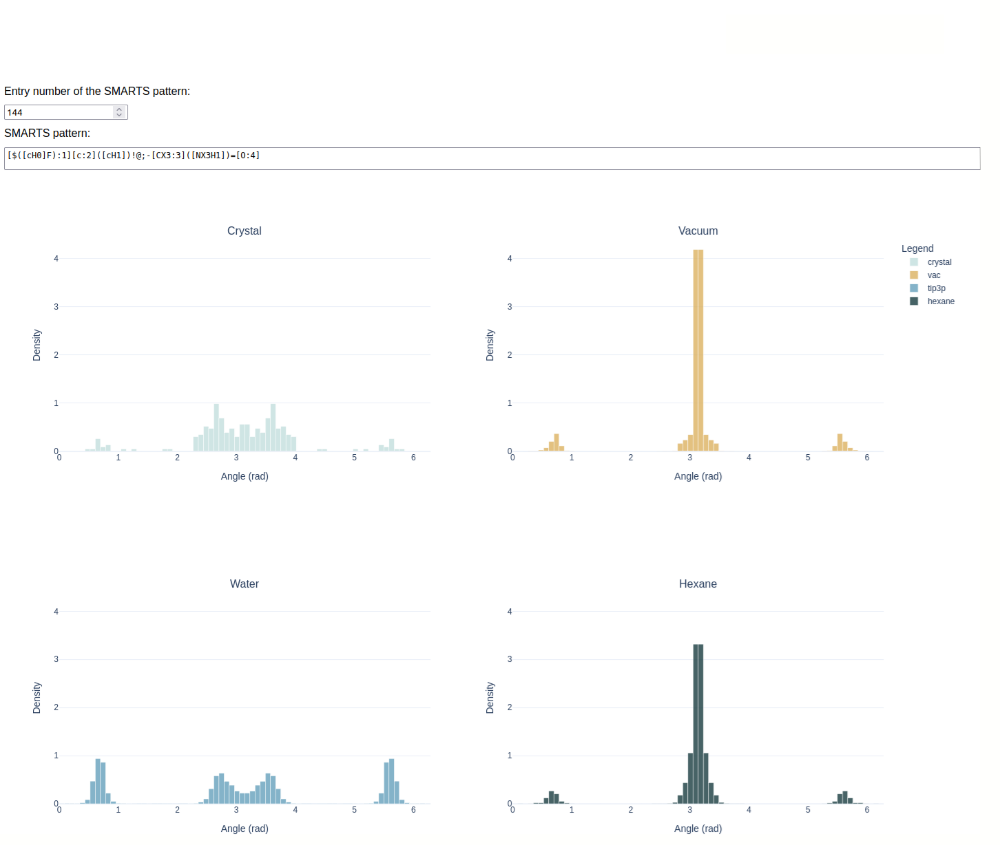

Torsion Motif Angle Distributions Across Different Environments
=================================================================
[](https://www.rdkit.org/)



## Publication
[1] TO BE ADDED

## Abstract
Understanding the conformational ensemble of molecules in different environments is at the core of many research efforts.
In conformer generation and geometry optimization, the complexity of the conformer space arises from the underlying torsion-angle distributions, which, in the case of force fields and some in silico conformer generators like ETKDG, are derived from accumulated torsion profiles for a predefined set of torsion motifs (termed "torsion motif angle distributions", TMADs).
Comparative studies of conformer generation and global optimization algorithms often neglect that the TMADs are sensitive to the environment they are extracted from, leading to comparisons of conformational ensembles and minimum-energy conformations from e.g. crystal versus vacuum environments.
Here, we present a large-scale comparative study of TMADs across different environments, namely crystal, vacuum, water, and hexane.
Our results show that the effects in the different environments, such as solvent-solute interactions in water and hexane, and packing effect in the crystal, produce strikingly distinct torsion distributions for most of the selected torsion motifs.
In addition to qualitative and quantitative comparison of the extracted TMADs, we also provide an automated fitting procedure that allows rapid parameterization of the distributions.
These newly found parameters can be employed in a solvent-specific conformer generation procedure in the future.

## Data and Software Availability
Due to licensing requirements for the Cambridge Structural Database (CSD) and to respect the integrity of established datasets, we provide scripts and documentation enabling the reproduction of the torsion histograms presented in this study instead of publishing the calculated structures itself.

## Installation
Install the environment using conda or mamba. 
```
mamba env create -f environment.yml
# activate env
conda activate GNNImplicitSolventAndTools
```
GNNIS and lwreg both can be installed with pip.
```
python -m pip install git+https://github.com/rinikerlab/GNNImplicitSolvent
python -m pip install git+https://github.com/rinikerlab/lightweight-registration
```

## Database
The pg_dump of the database used in this project can be found in Database/.
For the reconstruction of the postgresql database, the following steps need to be followed:
1) Set up a local PostgresSQL installation or use a postgres server. 
For the local setup, the directories for the database files need to be set up.
```
mkdir /home/<username>/Database
initdb -D /home/<username>/Database/psql17
# start postgresql server
pg_ctl -D /home/<username>/Database/psql17 -l /home/<username>/Database/psql17.log start
```
2) Creation of a new database on the server.
```
# remote server
createdb -U <username> -h <host> -p <port> -e <new dbname>
```
or
```
# local server
createdb -e <new dbname>
```
3) Change the USERNAMEPLACEHOLDER in Database/torsionMotifsStudy.sql to your postgres username.
4) Restore the schema.
> [!NOTE] 
> Restoring the schema includes the creation of the rdkit extension to be able to use the RDKit cartidge with data from the lwreg tables (see https://greglandrum.github.io/rdkit-blog/posts/2024-10-31-lwreg-and-the-cartridge.html). You need to have superuser rights unless your server has been configured otherwise. In the case of a local postgreSQL installation, you are the superuser by default.
```
# remote server
psql -U <username> -h <host> -p <port> -d <new dbname> -f torsionMotifsStudy.sql
```
or
```
# local server
psql -d <new dbname> -f torsionMotifsStudy.sql
```
5) Create a .pgpass file for passwordless logins to the database (see https://www.postgresql.org/docs/current/libpq-pgpass.html).
6) Change into the Database/ directory. Restore the lwreg configurations.
```
# remote server
python LwregConfigurations.py -H <hostname> -u <username> -d <dbname>
```
or
```
# local server
python LwregConfigurations.py -H localhost 
```
7) Restore the prepared torsion library. See section "Torsion Library" in [1] for details.
```
# remote server
psql -U <username> -h <host> -p <port> -d <dbname> -f et4hierarchy.sql
```
or
```
# local server
psql -d <dbname> -f et4hierarchy.sql
```
8) Restore the comparison results tables to be able to reproduce any result plots using comparison metrics shown in [1].
```
# remote server
psql -U <username> -h <host> -p <port> -d <dbname> -f comparisonsMetadata.sql
psql -U <username> -h <host> -p <port> -d <dbname> -f comparisonsMetrics.sql
```
or
```
# local server
psql -d <dbname> -f comparisonsMetadata.sql
psql -d <dbname> -f comparisonsMetrics.sql
```

## Data
As a prerequisite, an SD file with the 2024.03 version of the CSD is needed. <br/>
Here, an example file of 3 molecules (example.sdf, RDKit conformers of 3 CSD smiles) is provided.
Data curration for the CSD molecules:
```
python 1_CsdOriginalRegistration.py -H <hostname> -u <username> -d <dbname> -f <csd.sdf>
python 2_CsdCuration.py -H <hostname> -u <username> -d <dbname> -f csd202403registration.pkl
python 3_DihedralExtractions.py -H <hostname> -d <dbname> -u <username>
```
Please not for the following that the cache directory file path always has to be given as the full path. <br/>
For the precalculation of the AM1BCC charges:
```
python 4_CalculateAm1bccCharges.py -h <hostname> -u <username> -d <dbname> -cd <cachedir>
```
The GNNIS workflow for the calculation of the ensembles in the different solvents and the vaccum environment:
dat_1.txt is an example input file for running GNNtorsionCSD.py containing the molregnos and the cacheids from the am1bcc charge calculations.
```
# calculate vacuum ensemble and extract torsions
python 5_GNNtorsionsCSD.py -H <hostname> -u <username> -d <dbname> -f dat_1.txt -s vac -cd <cachedir>
# calculate water ensemble and extract torsions
python 5_GNNtorsionsCSD.py -H <hostname> -u <username> -d <dbname> -f dat_1.txt -s tip3p -cd <cachedir>
# calculate hexane ensemble and extract torsions
python 5_GNNtorsionsCSD.py -H <hostname> -u <username> -d <dbname> -f dat_1.txt -s hexane -cd <cachedir>
```
> [!NOTE] 
> For the DASH dataset, the same procedure is applied. Please note that the script will need to be adapted to read and write to the correct tables in the database.

## Analysis
**ComparisonMetrics.ipynb:** Demonstrates the statistical distances W<sub>2</sub> and ω as shown in [1]. <br/>
**CdfPlots.ipynb:** Shows the calculation and plotting of the corresponding cdfs for all three discussed statistical distances in [1]. <br/>
**TmadsMetricsVacVsCrystal.ipynb:** Notebook to reproduce the scatter plot with the metric comparisons for all vacuum and crystal torsion profiles. <br/>
**IdentifyHBonds.ipynb:** Showing the analysis for the example used in the section "Solvent-Solute Interactions in Water" in [1]. <br/>
**RetrieveEnsemble.ipynb:** Shows how to retrieve the coordinates of the calculates ensembles and restore them as rdkit conformers. Visualization with ngl view. <br/>
**Using the dash app:** The dash app that can be used when a fully populated database is available. Run with `python dashAppTorsionProfiles.py`.

## Results
`torsionHistogramsAllEnvs.pkl` contains a dictionary with torsion histograms for each torsion motif (SMARTS pattern) in the four environments:
```
[entrynr]
    - [smarts]
    - [bins]
    - [crystal]
    - [vac]
    - [water]
    - [hexane]
```
The entrynr is a unique identifier that was assigend to each SMARTS pattern.
For visual expection of the differences in the torsion motif angle distributions, the dash app displaying the torsion histograms can be executed with
```
python torsionProfilesVizApp.py
```
`fitCoeffsAllEnvs.pkl` contains a dictionary with all coefficients for the Wrapped Mirrored Gaussian fits (see https://github.com/rinikerlab/TorsionDistributionFitting). The structure of the dictionary is as follows:
```
[entrynr]
    - [smarts]
    - [coeffsVac]
    - [coeffsWater]
    - [coeffsHexane]
    - [coeffsCrystal]
```
Each coeff array of shape nx3 was flattened before adding it to the dictionary.

## Authors
Jessica Braun

## Project status
done
